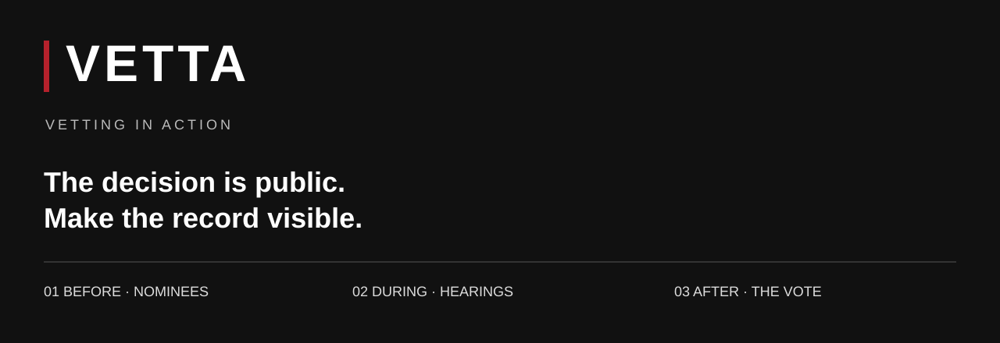

[](https://github.com/Jimmy-Hernandez/vetting-loop/actions/workflows/ci.yml)
[](LICENSE)
[](docs/DATA-QUALITY.md)

**Who was nominated. What citizens submitted. What the committee asked. How the decision was made.**

Vetta connects the stages of Kenyan parliamentary vetting in one source-linked
public record. Its central exhibit is the August 2024 Cabinet vetting: **20 nominees,
19 approvals and one rejection**. The approvals passed by **voice vote**. The record
contains no individual MP roll call; Vetta makes that absence visible without
inventing votes or treating an allegation as a verdict.

**Start here:** [Judge walkthrough](docs/JUDGE-GUIDE.md) · [Architecture](docs/ARCHITECTURE.md) ·
[Data quality](docs/DATA-QUALITY.md) · [Verification](docs/VERIFICATION.md) ·
[Source handover](docs/SOURCE-SYNC.md)

> [!IMPORTANT]
> **Working hackathon application; editorial verification remains open.** The checked-in
> record contains provisional and OCR-derived material. Structural tests do not certify
> factual accuracy. Nostr publication remains deliberately paused pending due diligence.
> The companion API and encrypted-tip code are preserved source, not features enabled in
> the primary demo.

## See the record


*Actual application screenshot, not a concept rendering. Mobile and vote screenshots
are included in [verification evidence](docs/VERIFICATION.md).*

## The accountability loop

| Stage | Reader can inspect | Evidence boundary |
|---|---|---|
| Before | Nominees, sourced flags and positive findings | Allegation is not conviction |
| During | Committee questions and provisional memorandum extracts | OCR and completeness require review |
| After | Decision, voice-vote absence and recorded-division contrast | No fabricated individual votes |
| Across time | Appointment ledger and cycles | People and nominations are distinct counts |

The committed snapshots contain **93 people, 111 nominations and 10 cycles**;
the detailed episode contains **510 reconstructed committee-question entries,
33 flags and 82 positive findings**. These are dataset counts, not a finding that
every entry has passed primary-source review. The 11 provisional memorandum entries
are not a complete or verified count of ignored citizen questions.

## Run in minutes

Requires **Node 22.12+** and npm. No cloud account, API key or paid service is required
for the main application.

```bash
git clone https://github.com/Jimmy-Hernandez/vetting-loop.git
cd vetting-loop
npm ci
npm ci --prefix app
npm run dev
```

Open the URL printed by Vite. To reproduce the verification and production build:

```bash
npm test
npm run check:record
npm run lint
npm run build
npm run preview --prefix app
```

The build is `app/dist/`. Serve it over HTTP with a single-page-app fallback to
`index.html`; do not open it using `file://`. The included `_redirects` covers hosts
that support that format. CI packages the build as a downloadable Actions artifact.
CI does not deploy the application or publish any Nostr events.

## How it works

The public application is **React + TypeScript + Vite** over checked-in JSON.
Source documents and extraction outputs live under `data/`; the served snapshots
live under `app/public/data/`. Data-thin views connect dossiers, hearings and the
vote trail. The broader appointment ledger joins by person/slug.

The project includes extraction and signed-event tooling, but the current app does
not invoke a live AI model. Signed publication is an optional layer; signatures
would establish publisher integrity, not truth. See [architecture](docs/ARCHITECTURE.md).

## Repository orientation

| Path | Role |
|---|---|
| [`app/`](app/) | Primary application and public JSON snapshots |
| [`data/`](data/) | Source archive, OCR extracts and correction history |
| [`scripts/`](scripts/) | Assembly, structural checks and gated Nostr tools |
| [`docs/`](docs/) | Judge guide, architecture, audit and verification |
| [`implementations/agent9/`](implementations/agent9/) | Complete preserved Agent9 companion source snapshot |
| [`services/relay/`](services/relay/) | Optional Go relay source; outside the default demo |

The [source-sync manifest](docs/source-sync-manifest.json) records checksums for the
companion source files. Dependencies, build outputs, runtime state and signing keys
are excluded. Historical handoff notes remain for provenance; current operating
state is documented here and in [SOURCE-SYNC](docs/SOURCE-SYNC.md).

## Credibility and contribution

Read [DATA-GUARDRAILS](DATA-GUARDRAILS.md) and [CONTRACTS](CONTRACTS.md) before editing
records. Cite primary evidence, retain legal-status distinctions and apply the same
evidence bar to positive findings. Corrections belong in `data/CHANGELOG.md`.

[CONTRIBUTING](CONTRIBUTING.md) defines local checks and review expectations.
[SECURITY](SECURITY.md) separates public bug reports from sensitive reports.
[ROADMAP](docs/ROADMAP.md) lists the remaining evidence and usability work.

## Sources, purpose and license

Built for civic accountability in the context of [AI Hack for Freedom III](https://www.aihackforfreedom.org/).
The judge guide explains the freedom-tech relevance and demonstration boundaries;
no contest placement, endorsement or completed submission is claimed.

Sources include the Parliament of Kenya, Hansard, Committee on Appointments reports,
Mzalendo voting records and individually cited reporting. See [ATTRIBUTION](ATTRIBUTION.md).
Code is [MIT](LICENSE). Third-party data and content retain their own terms;
Mzalendo-derived datasets are subject to the attribution and ShareAlike terms stated
in the source attribution file.
