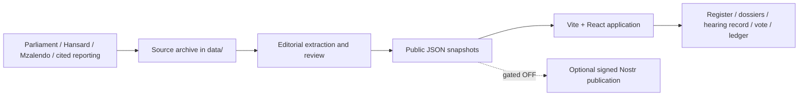

# Architecture and implementation boundaries

## Default runtime

`app/` is a Vite, React and TypeScript single-page application. It reads JSON from
`app/public/data/` using `app/src/data.ts`. Nominee records join the broader ledger
through `slugSeam.ts` and `terryTypes.ts`. Routes use BrowserRouter. A static host
must serve `index.html` for application paths; `_redirects` provides that rule for
compatible hosts. `npm run preview --prefix app` serves the build locally.
Do not open `dist/index.html` through `file://`: JSON fetches and clean routes require HTTP.

The build needs no cloud credentials, account, database or model API. Checked-in
extraction outputs are reviewed inputs; there is no live AI inference in the public
app and no automatic claim that extraction is accurate. Sources may be unavailable
or OCR may be wrong. `needs_verification` is an uncertainty marker, not a guarantee
that every unmarked field has been independently verified.

## Companion implementation

`implementations/agent9/` preserves Terry's separate Next.js / pnpm monorepo,
including its API, database schema, UI, integrity, ledger and sealed-tip packages.
It is included to complete the source handover, not imported into the Vite runtime.
Its historical README, deployment configurations and demo fixtures describe that
implementation and must not be mistaken for the current app's operating state.
Its nested `.github` directory is archival and is not executed by GitHub Actions.

## Optional relay

`services/relay/` contains the Go relay source and dependency locks. It is not
started by the app or CI. Root `scripts/nostr/` retains the existing publication
kill switch. No private signing keys, relay database or relay binary is included.
The source sync does not activate the relay or certify it for sensitive tips.

## Trust boundary

A signed record proves authorship and integrity, not factual correctness. Approval
of code is separate from editorial approval and network publication. Preserve the
existing two-gate publisher authorization and the default-off browser reader.
