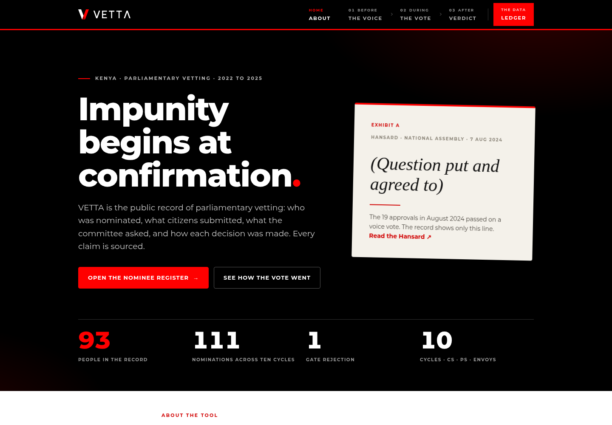
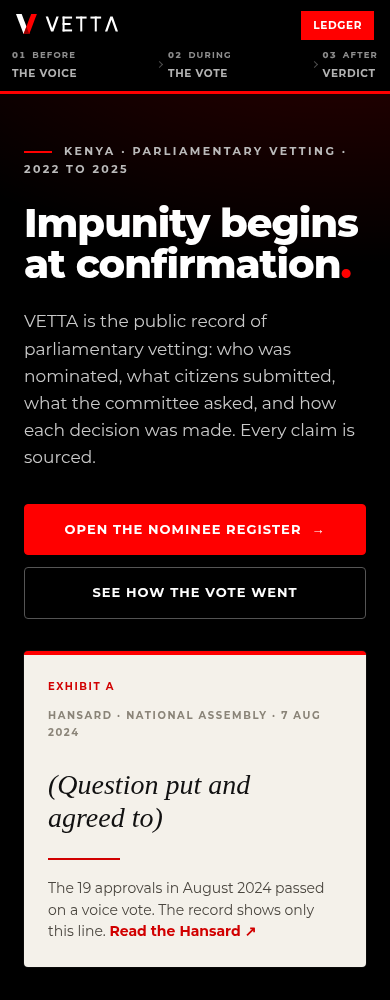
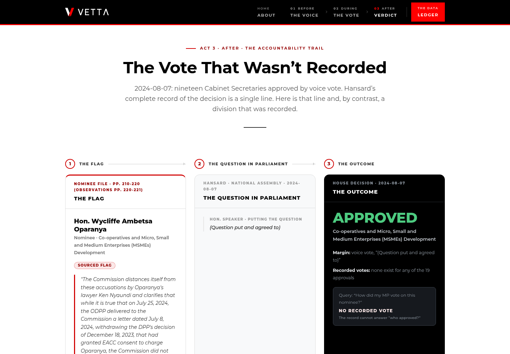

# Verification evidence — 2026-09-25

## Primary application

| Check | Result | Boundary |
|---|---|---|
| Locked install and TypeScript/Vite build | Passed | Local Node 22; production static bundle generated |
| Structural record checks | Passed | Not a factual or full editorial certification |
| Regression tests | 8 passed | Four data-integrity cases and four authorization combinations |
| Lint | Passed with one warning | Existing count-up effect warning in About.tsx |
| Browser smoke checks | 16 passed | Eight routes at 1440px and 390px; nonempty content, heading, no page exception or horizontal overflow |
| Nostr preflight | Passed | Publisher refuses by default and browser flag remains off |
| Source manifest | 156 files checked | SHA-256; one documented TypeScript configuration correction |

Browser checks ran against the local **production build**, using Chromium on an
ARM64 Pi. They include direct navigation to each route, exercising the local SPA
fallback. They are not a full accessibility audit, device-lab test, production
uptime check or field-performance measurement. See [raw results](browser-checks.json).

## Companion and service boundaries

The companion's existing integrity, ledger and sealed-submission tests report
**41 passed, 0 failed**. Package typechecks are exercised separately
from the Vite build. The entire
Next.js/API deployment and the optional Go relay have not been redeployed or
independently audited in this handover. Preserved source is not a live-service claim.

## CI and known limits

The workflow performs the main app checks, packages a static demo artifact and
runs the companion package tests/typechecks on GitHub. Consult the commit's actual
[Actions result](https://github.com/Jimmy-Hernandez/vetting-loop/actions) for remote
status; this document does not turn a configured workflow into a successful run.

The [77-field editorial review queue](DATA-QUALITY.md) remains open. External source
availability, quote fidelity and OCR-to-nominee attribution are not certified.
Nostr publication is still paused. No contest entry was submitted by these checks.
