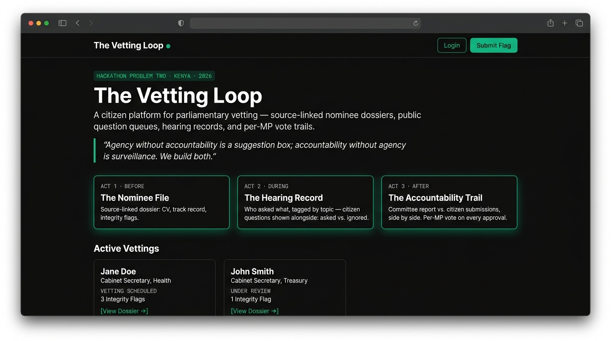
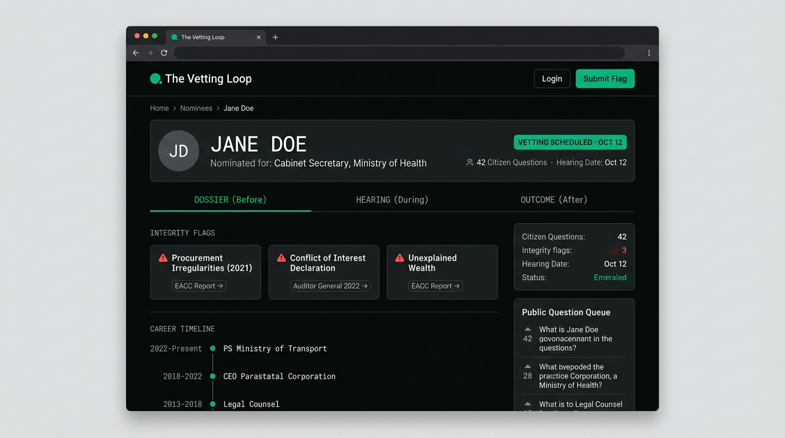
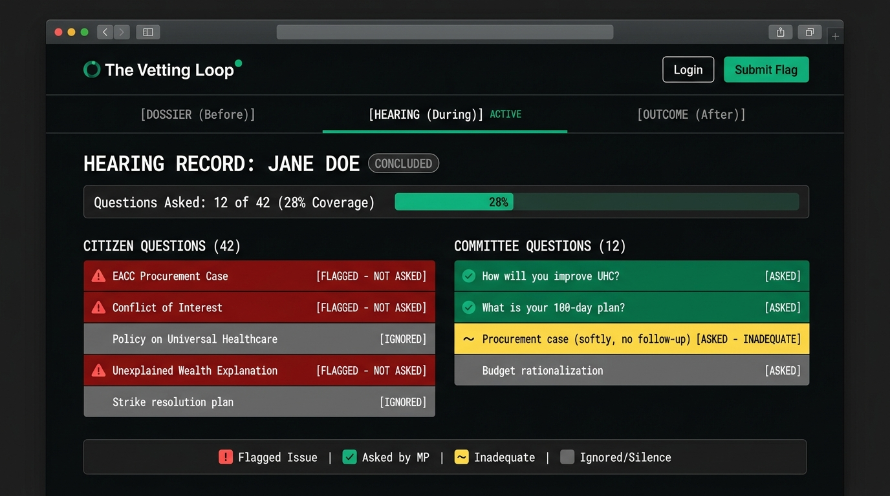
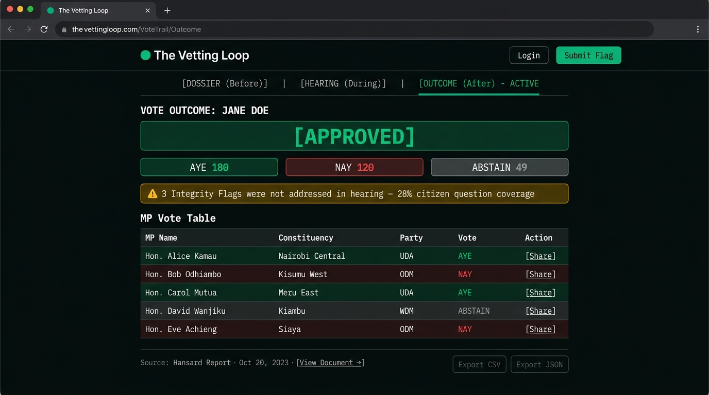
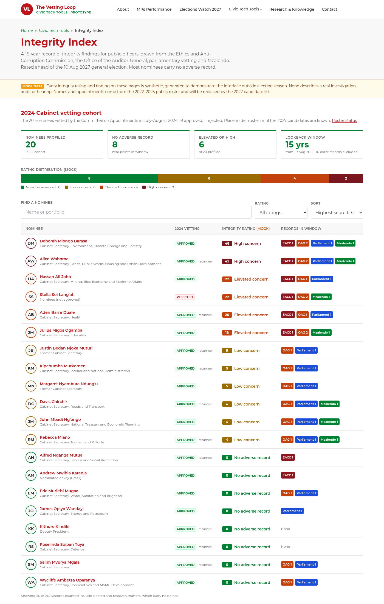

# The Vetting Loop

> **"Agency without accountability is a suggestion box; accountability without agency is surveillance. We build both."**

A citizen platform for parliamentary vetting in Kenya — built as a module on [Mzalendo's](https://mzalendo.com) existing parliamentary-monitoring rails.

---

## Screenshots

| Homepage | Nominee Dossier |
|----------|----------------|
|  |  |

| Hearing Record / Silence Map | Vote Trail |
|------------------------------|------------|
|  |  |

→ Full design spec and tokens: [docs/MOCKUPS.md](docs/MOCKUPS.md)

---

## What It Does

The Vetting Loop closes the gap between citizens and Parliament across three acts of every public appointment:

| Act | Phase | Deliverable |
|-----|-------|-------------|
| **Before** | T-30 → Hearing day | Source-linked nominee dossier + public question queue |
| **During** | 28-day statutory window | Hearing record: questions asked vs. ignored, per topic |
| **After** | Post-vote | Committee report vs. citizen submissions, per-MP vote trail |

Each episode leaves a durable, citable record — shareable at the next election.

---

## Integrity Index (Civic Tech Tools)

A 15-year integrity record for public officers, styled to sit under Mzalendo's **Civic Tech Tools** menu.

| Page | Route |
|------|-------|
| Index of the 20-member 2024 Cabinet vetting cohort, with ratings | `/integrity` |
| Profile: rating, 15-year timeline, findings by source, appointment history | `/integrity/[slug]` |
| Methodology: sources, weights, bands, safeguards | `/integrity/methodology` |
| Roster status (2027 placeholder) | `/integrity/roster` |
| Civic Tech Tools landing | `/civic-tech` |

- **Sources:** EACC, Office of the Auditor-General, parliamentary vetting / National Assembly, Mzalendo.
- **Lookback:** hard 15-year window ending on election day (10 Aug 2027). Older records are shown but score zero.
- **Scoring and data:** `packages/integrity` (pure TypeScript, unit-tested).
- **Mock data:** every finding and rating is synthetic and stamped MOCK. Mock bands are assigned by a hash of the slug against a fixed 8/6/4/2 distribution, so no rating reflects the person's reputation. Integrity pages are `noindex`.
- **Public deployment:** set `NEXT_PUBLIC_MOCK_IDENTITY=pseudonym` to replace real names with neutral labels while findings are synthetic.
- **2027 roster:** replace `PROFILED_ROSTER` in `packages/integrity/src/roster.ts`.



---

## Architecture Overview

```
vetting-loop/
├── apps/
│   ├── web/          # Next.js 14 public frontend (App Router)
│   └── api/          # Hono API on Cloudflare Workers
├── packages/
│   ├── db/           # Drizzle ORM + D1 schema & migrations
│   ├── types/        # Shared TypeScript types (nominee, question, vote)
│   └── ui/           # Shared Tailwind component library
├── docs/             # Architecture decisions, data models, design constraints
├── infra/            # Terraform / Wrangler config
├── scripts/          # Data-import helpers (Mzalendo, Hansard, EACC)
└── .github/
    └── workflows/    # CI, deploy, data-sync
```

This is a **Turborepo monorepo**. The web app and API are deployable independently.

---

## Tech Stack

| Layer | Choice | Rationale |
|-------|--------|-----------|
| Frontend | Next.js 14 (App Router) | SSR for SEO; citizen-facing pages need fast TTFB |
| API | Hono on Cloudflare Workers | Edge latency; zero cold start for public endpoints |
| Database | Cloudflare D1 (SQLite) | Zero-ops; structured data fits relational model |
| Search | Cloudflare Vectorize | Semantic search over dossier documents |
| Auth | Clerk | Social login + roles (citizen / CSO / admin) |
| ORM | Drizzle | Type-safe; D1-native migrations |
| Monorepo | Turborepo | Shared packages; parallel builds |
| Styling | Tailwind CSS | Utility-first; consistent with Mzalendo palette |
| Testing | Vitest + Playwright | Unit + E2E |

---

## MVP Scope (Hackathon Weekend)

**In:**
- One real past CS vetting episode, source-linked
- Nominee dossier with integrity flags
- Public question queue with upvotes
- Asked-vs-ignored hearing log
- Per-MP vote view

**Out (mocked/deferred):**
- Live-stream integration
- Multi-episode history
- Kiswahili UI
- Accounts & notifications

**The signature demo moment:**
> A source-linked integrity flag — beside the transcript where no MP asked about it — beside the vote tally where everyone approved.

---

## Design Constraints

1. **Defamation safety** — Every integrity flag cites a source document. No bare allegations.
2. **Non-partisanship** — Outputs criticise process, not persons. Vocabulary: participation, oversight, Chapter Six.
3. **Durability** — Every record permanent, exportable in structured formats (JSON, CSV).

---

## Getting Started

### Prerequisites

- Node.js ≥ 20
- pnpm ≥ 9
- Cloudflare account (Workers, D1, Vectorize)
- Wrangler CLI ≥ 3

### Install

```bash
git clone https://github.com/agent9ai/vetting-loop.git
cd vetting-loop
pnpm install
```

### Environment

```bash
cp .env.example .env
# Fill in: CLERK_SECRET_KEY, D1_DATABASE_ID, VECTORIZE_INDEX
```

### Develop

```bash
pnpm dev          # starts web (localhost:3000) + api (localhost:8787) in parallel
```

### Test

```bash
pnpm test         # unit tests via Vitest
pnpm test:e2e     # Playwright end-to-end
```

### Deploy

```bash
pnpm deploy       # runs turbo deploy → api (wrangler publish) + web (Next.js build → Pages)
```

---

## Data Sources

| Source | What It Provides | Integration |
|--------|-----------------|-------------|
| [Mzalendo](https://mzalendo.com) | Committee reports, MP voting histories, scorecards | REST pull + nightly sync |
| Kenya Hansard | Hearing transcripts | PDF parse → structured JSON |
| EACC | Ethics & Anti-Corruption Commission adverse reports | Manual-curated seed; flags require source doc |
| Kenya Gazette | Nomination gazettement | Scrape on new vetting episode |

---

## Contributing

See [CONTRIBUTING.md](CONTRIBUTING.md). All integrity-flag PRs require a linked source document in `docs/sources/`. No bare allegations merged.

---

## License

MIT — see [LICENSE](LICENSE).

---

*Hackathon Problem Two · September 2026 · Built with Caroline Gaita, Jimmy, Terry Richards (Agent9)*
